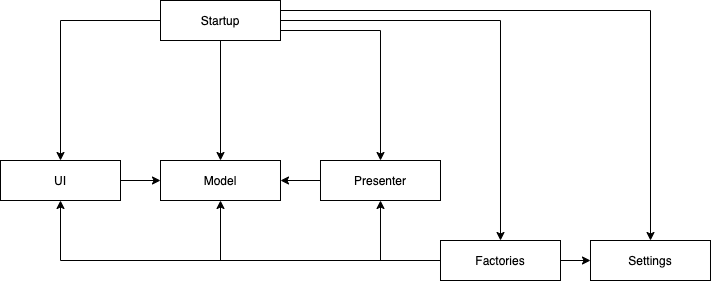

# Архитектура

## Экраны

Игра разделена на экраны. Каждый экран представлен сценой (Начальный экран, Игровой экран). При загрузке каждой сцены все необходимы объекты, необходимые для работы этого экрана, создаются. Во время работы сцены никакие объекты не создаются и не освобождаются, но переиспользуются, чтобы во время работы сцены сборщик мусора не вызывал подвисания. В случае когда нужно множество экземпляров (пули, мобы), используются пулы. Во время переходов между экранами вызывается сборщик мусора, чтобы он не начал собирать остатки с предыдущего экрана во время работы следующего.

## Модули

### Model

Здесь описывается игровая логика и интерфейсы, используемые ею

### Presenter

Описывает как состояние моделей представляется в среде Unity. Содержит адаптеры функционала Unity для моделей. Адаптеры реализуют соответствующие интерфейсы модуля Model

### Settings

Описывает способы конфигурирования игровых сущностей. Используются ScriptableObjects и MonoBehaviour.

### Factories

Содержит логику созданию объектов, описывает откуда берутся значения для их конфигурирования, и создаёт вспомагательные объекты (Например презентеры к моделям).

### UI

Описывает способы взаимодействия пользователя с игрой. Это включает графический интерфейс и обработка ввода, с последующей передачей сообщений моделям

### Startup

Создаёт необходимые объекты при запуске экрана при переходе. Создаёт необходимые объекты для работы всего приложения при запуске. Использует Dependency Injection
